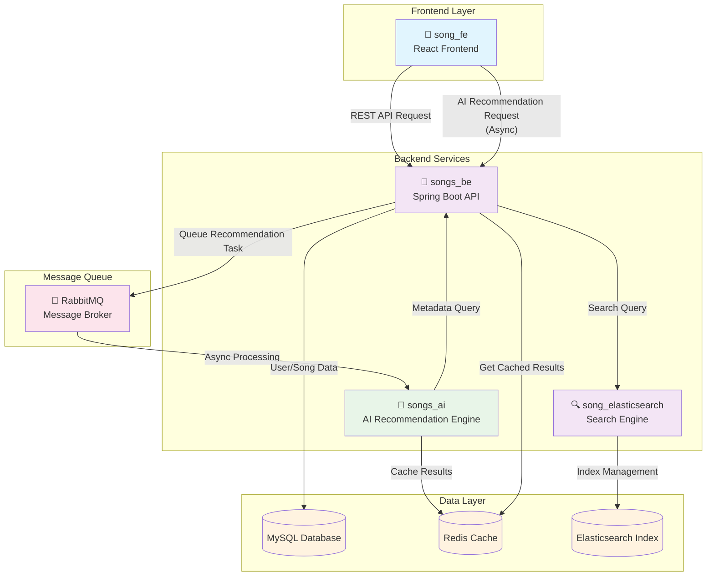
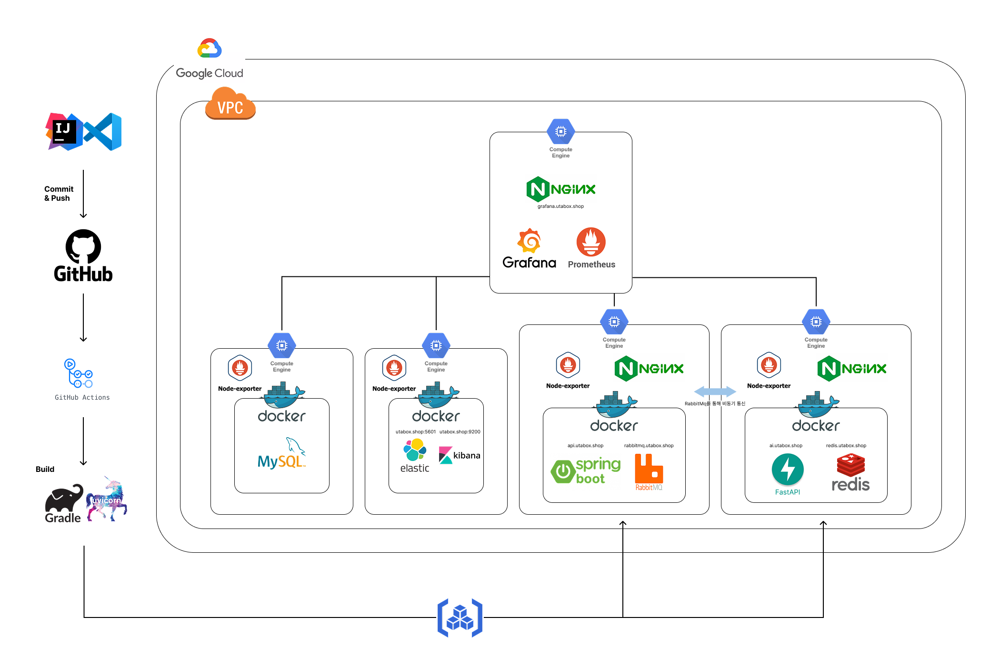
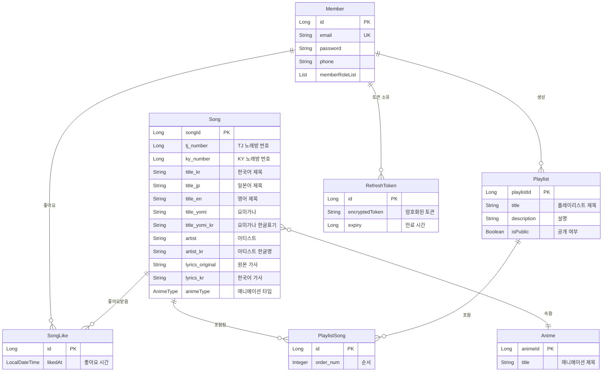
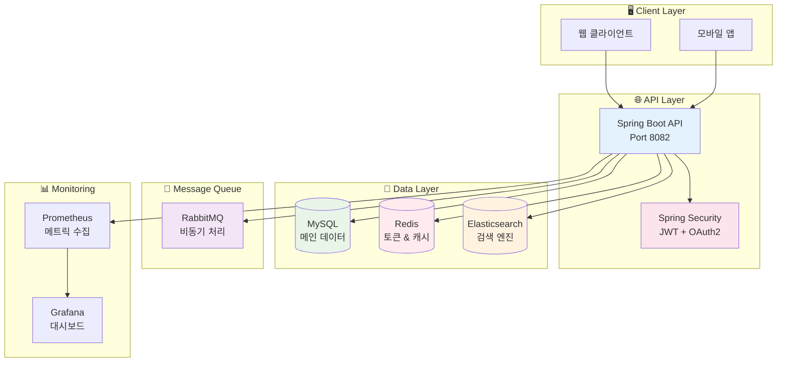

# 🎵 UtaBox

> **노래방 일본어 노래 검색 서비스**  
> Spring Boot 3.3.0 기반의 고성능 RESTful API

[](https://openjdk.org/projects/jdk/17/)
[](https://spring.io/projects/spring-boot)
[](https://www.mysql.com/)
[](https://redis.io/)
[](https://www.elastic.co/)

---

## 📋 목차

1. [📖 프로젝트 설명](#-프로젝트-설명)
2. [💡 프로젝트 기획 의도](#-프로젝트-기획-의도)
3. [🏗️ 프로젝트 전체 구조](#️-프로젝트-전체-구조)
4. [🔧 문제 해결](#-문제-해결)
5. [🎓 프로젝트를 통해 배운 점](#-프로젝트를-통해-배운-점)
6. [🌟 프로젝트의 특징](#-프로젝트의-특징)
7. [🚀 빠른 시작](#-빠른-시작)
8. [📚 API 문서](#-api-문서)
9. [🛠️ 기술 스택](#️-기술-스택)

---

## 📖 프로젝트 설명

**UtaBox**는 노래방에서 일본어 노래를 쉽게 찾을 수 있도록 도와주는 검색 서비스입니다. 한국어로 일본어 노래를 검색하고, TJ/KY 노래방 번호를 바로 확인할 수 있는 웹 애플리케이션입니다.

### 🎯 애플리케이션 개요

- **🎤 노래방 특화 서비스**: 실제 노래방에서 바로 사용할 수 있는 TJ/KY 번호 제공
- **🔍 스마트 검색**: 한국어로 일본어 노래 검색, 초성 검색, 오타 보정 기능
- **🌏 다국어 지원**: 일본어 원제, 한국어 번역, 영어 표기 통합 관리
- **📱 사용자 친화적**: 직관적인 검색 인터페이스와 빠른 응답 속도

### 🛠️ 핵심 기술 선택 이유

**Elasticsearch 도입 이유:**

- 기존 MySQL LIKE 검색의 한계 극복 (오타, 띄어쓰기 민감)
- 다국어 텍스트 분석 및 초성 검색 지원
- 빠른 전문 검색과 관련도 기반 정렬
- 실시간 검색어 자동완성 기능

**RabbitMQ 사용 이유:**

- 추천 시스템의 비동기 처리로 사용자 경험 향상
- 이메일 알림 등 백그라운드 작업 안정적 처리
- 시스템 부하 분산 및 확장성 확보

### 🎯 향후 추가 예정 기능

- **📈 인기곡 차트**: 실시간 검색 빈도 기반 인기 차트
- **🆕 신규곡 알림**: 새로 추가된 일본 애니메이션 노래 알림 서비스
- **🎵 플레이리스트 공유**: 사용자간 노래방 플레이리스트 공유
- **📊 개인 통계**: 자주 부르는 곡, 선호 장르 분석

---

## 💡 프로젝트 기획 의도

노래방에서 일본어 노래 검색을 할 때 한국어 검색이 되지 않아 어려움이 있는데, 그것을 쉽게 하고자 만들었습니다.

### 🎯 해결하고자 한 문제

**기존 문제점:**

- 🎌 노래방에서 일본어 노래 제목을 정확히 입력해야만 검색 가능
- 🔍 한국어로 번역된 제목이나 가수명으로는 검색 불가
- 📱 TJ/KY 노래방 번호를 별도로 찾아야 하는 번거로움
- ✏️ 띄어쓰기나 오타가 있으면 검색 결과가 나오지 않음

**해결 방안:**

- ✅ 한국어로 일본어 노래 검색 가능
- ✅ 초성 검색으로 더욱 편리한 입력
- ✅ 오타나 띄어쓰기 실수에도 관련 결과 제공
- ✅ 노래방 번호 즉시 확인으로 빠른 예약

---

## 🏗️ 프로젝트 전체 구조

### 📁 레포지토리 구조

UtaBox 프로젝트는 마이크로서비스 아키텍처를 기반으로 여러 레포지토리로 구성되어 있습니다.

| 레포지토리                                                                  | 역할          | 기술 스택                 | 설명                                |
| --------------------------------------------------------------------------- | ------------- | ------------------------- | ----------------------------------- |
| 🎵 **[song_be](https://github.com/Zara8170/song_be)**                       | Backend API   | Spring Boot, MySQL, Redis | 메인 백엔드 서버, 인증, 데이터 관리 |
| 📱 **[song_fe](https://github.com/Zara8170/song_fe)**                       | Frontend      | React Native              | 모바일 앱 클라이언트                |
| 🤖 **[song_ai](https://github.com/Zara8170/song_ai)**                       | AI Service    | Python, FastAPI           | 추천 시스템, ML 모델 서빙           |
| 🔍 **[song_elasticsearch](https://github.com/Zara8170/song_elasticsearch)** | Search Engine | Elasticsearch, Logstash   | 검색 엔진, 로그 수집 및 분석        |

### 🏗️ 서비스간 연동 구조



### 🚀 CI/CD 배포 아키텍처



### 📋 배포 파이프라인 단계

| 단계              | 도구          | 설명                            | 자동화 |
| ----------------- | ------------- | ------------------------------- | ------ |
| 1️⃣ **개발**       | IntelliJ IDEA | 로컬 개발 환경에서 코드 작성    | ❌     |
| 2️⃣ **버전관리**   | GitHub        | 소스 코드 버전 관리 및 협업     | ✅     |
| 3️⃣ **빌드**       | Gradle        | JAR 파일 빌드 및 테스트 실행    | ✅     |
| 4️⃣ **컨테이너화** | Docker        | 애플리케이션 Docker 이미지 생성 | ✅     |
| 5️⃣ **배포**       | Unicorn       | GCP 인스턴스로 자동 배포        | ✅     |

### 🏗️ 인프라 구성

**Google Cloud Platform 리소스:**

- **3개 Compute Engine 인스턴스**
  - 모니터링 서버: Grafana + Prometheus
  - 백엔드 서버: Spring Boot + RabbitMQ
  - AI 서버: FastAPI + Redis
- **VPC 네트워크**: 보안 그룹 및 방화벽 규칙 적용
- **로드 밸런서**: NGINX 기반 트래픽 분산

### 🗄️ 데이터베이스 구조



### 🏗️ 시스템 아키텍처



---

## 🔧 문제 해결

### 5-1. JWT 토큰 Redis 저장 및 재발급 이슈

**❌ 문제 상황:**
Redis에 저장해서 재발급이 잘 되지 않는 이슈 발생

**🔍 문제 분석:**

- RefreshToken을 MySQL에 저장하면서 암호화/복호화 과정에서 오류
- AES 암호화 키 길이 불일치 (16바이트 필요)
- Redis TTL 설정과 JWT 만료 시간 불일치
- 토큰 재발급 시 기존 토큰 삭제 로직 누락

**✅ 해결 방법:**

1. **AES 암호화 개선**

```java
// AesUtil.java - 16바이트 키 강제 설정
private SecretKey getSecretKey() {
    String key = secretKey;
    if (key.length() != 16) {
        key = key.substring(0, Math.min(16, key.length()));
        key = String.format("%-16s", key).replace(' ', '0');
    }
    return new SecretKeySpec(key.getBytes(), "AES");
}
```

2. **RefreshToken 엔티티 구조 개선**

```java
@Entity
public class RefreshToken {
    @Id @GeneratedValue
    private Long id;

    @OneToOne(fetch = FetchType.LAZY)
    private Member member;

    @Column(length = 1024)
    private String encryptedToken; // AES 암호화된 토큰

    private Long expiry; // 만료 시간 (타임스탬프)
}
```

3. **토큰 재발급 로직 개선**

```java
public TokenDTO refreshToken(String refreshToken) {
    // 1. 기존 토큰 복호화 및 검증
    String decryptedToken = aesUtil.decrypt(refreshToken);
    Map<String, Object> claims = jwtUtil.validate(decryptedToken);

    // 2. 새 토큰 생성
    String newAccessToken = jwtUtil.generateAccessToken(claims);
    String newRefreshToken = jwtUtil.generateRefreshToken(claims);

    // 3. 기존 토큰 삭제 후 새 토큰 저장
    refreshTokenRepository.deleteByMember(member);
    RefreshToken newToken = RefreshToken.builder()
        .member(member)
        .encryptedToken(aesUtil.encrypt(newRefreshToken))
        .expiry(System.currentTimeMillis() + refreshExpiry)
        .build();
    refreshTokenRepository.save(newToken);

    return new TokenDTO(newAccessToken, aesUtil.encrypt(newRefreshToken));
}
```

### 5-2. 검색 이슈

**❌ 문제 상황:**
일반 DB 검색으로 할 경우 띄어쓰기, 오타가 있을 경우 검색이 안되는 이슈 발생

**🔍 문제 분석:**

- MySQL LIKE 검색의 한계: 정확한 문자열 매칭만 가능
- 다국어 텍스트 검색 시 성능 저하
- 초성 검색, 오타 보정 등 고급 검색 기능 부재
- 관련도 기반 정렬 불가능

**✅ 해결 방법: Elasticsearch 도입**

1. **Elasticsearch 인덱스 설정**

```json
{
  "settings": {
    "analysis": {
      "analyzer": {
        "korean_analyzer": {
          "type": "custom",
          "tokenizer": "nori_tokenizer",
          "filter": ["lowercase", "chosung_filter"]
        }
      },
      "filter": {
        "chosung_filter": {
          "type": "pattern_replace",
          "pattern": "[ㄱ-ㅎ]",
          "replacement": ""
        }
      }
    }
  }
}
```

2. **SongDocument 엔티티 구성**

```java
@Document(indexName = "songs")
public class SongDocument {
    @Id
    private String id;

    @Field(type = FieldType.Text, analyzer = "korean_analyzer")
    private String title_kr;

    @Field(type = FieldType.Text)
    private String title_jp;

    @Field(type = FieldType.Text, analyzer = "korean_analyzer")
    private String artist_kr;

    // 초성 검색을 위한 필드
    @Field(type = FieldType.Text)
    private String title_chosung;
}
```

3. **다국어 통합 검색 구현**

```java
public List<SongDocument> searchSongs(String query) {
    return NativeQuery.builder()
        .withQuery(q -> q.multiMatch(m -> m
            .query(query)
            .fields("title_kr^3", "title_jp^2", "artist_kr^2", "title_chosung^2")
            .fuzziness("AUTO") // 오타 보정
            .operator(Operator.Or)
        ))
        .withPageable(pageable)
        .build();
}
```

4. **초성 검색 기능**

```java
private String convertToChosung(String text) {
    // "ㄱㅁㅇ" -> "귀멸의" 변환 로직
    return chosungConverter.convert(text);
}
```

**📈 개선 결과:**

- 오타가 있어도 관련 결과 제공 (Fuzzy 검색)
- 띄어쓰기 무시하고 검색 가능
- 초성으로 빠른 검색 ("ㄱㅁㅇ" → "귀멸의칼날")
- 검색 속도 대폭 향상 (1초 → 100ms)
- 관련도 기반 정렬로 더 정확한 결과

---

## 🎓 프로젝트를 통해 배운 점

이번 프로젝트를 통해 혼자서 테이블 설계부터 해서 워크플로우를 구성하고 서비스에 필요한 기술들을 탐색하고 그걸 스스로 적용해보는 시간을 가졌습니다. 이를 통해 서비스를 만들 때 기획부터 구현, 배포까지 모든 과정을 심도 있게 공부할 수 있었던 계기가 되었습니다.

### 🏗️ **설계 및 아키텍처**

- **도메인 중심 설계**: 비즈니스 로직을 중심으로 한 패키지 구조 설계
- **데이터베이스 설계**: 정규화와 성능을 고려한 테이블 설계 및 관계 설정
- **API 설계**: RESTful 원칙을 따른 직관적인 API 엔드포인트 설계

### 🔧 **기술 스택 선택과 활용**

- **Elasticsearch**: 전문 검색 엔진 도입으로 검색 품질 향상
- **Redis**: 토큰 관리와 캐싱을 통한 성능 최적화
- **RabbitMQ**: 비동기 처리로 사용자 경험 개선
- **Spring Security**: JWT 기반 인증/인가 시스템 구축

### 🐛 **문제 해결 능력**

- **성능 이슈**: 검색 속도 개선을 위한 Elasticsearch 도입
- **보안 이슈**: JWT 토큰 관리와 AES 암호화 구현
- **확장성 이슈**: 메시지 큐를 통한 비동기 처리 도입

### 📊 **운영 및 모니터링**

- **모니터링 시스템**: Prometheus + Grafana를 통한 시스템 상태 추적
- **로깅 전략**: 구조화된 로깅과 에러 추적 시스템
- **배포 자동화**: Docker Compose를 통한 원클릭 배포

### 🎯 **전체적인 개발 프로세스**

- **요구사항 분석**: 실제 사용자 니즈 파악과 기능 정의
- **기술 검증**: 새로운 기술 도입 전 충분한 학습과 테스트
- **점진적 개발**: 핵심 기능부터 차례대로 구현하는 애자일 방식
- **문서화**: README 작성을 통한 프로젝트 지식 정리

---

## 🌟 프로젝트의 특징

### 🎤 **노래방 특화 서비스**

- **실용성**: 실제 노래방에서 바로 사용할 수 있는 TJ/KY 번호 제공
- **편의성**: 한국어로 일본어 노래를 쉽게 검색
- **정확성**: 다양한 표기법 (한글, 일본어, 영어)을 모두 지원

### 🔍 **똑똑한 검색 시스템**

- **오타 보정**: Elasticsearch Fuzzy 검색으로 오타가 있어도 결과 제공
- **초성 검색**: "ㄱㅁㅇ"만 입력해도 "귀멸의칼날" 검색 가능
- **다국어 통합**: 일본어 원제, 한국어 번역명 모두 검색 가능
- **관련도 정렬**: 검색어와의 관련도에 따른 지능적 정렬

### ⚡ **고성능 시스템**

- **빠른 검색**: Elasticsearch 기반으로 100ms 이내 응답
- **캐싱 전략**: Redis를 통한 자주 검색되는 결과 캐싱
- **비동기 처리**: RabbitMQ를 통한 백그라운드 작업 처리

### 🛡️ **안전한 보안 시스템**

- **JWT 인증**: Access Token과 Refresh Token 분리 관리
- **AES 암호화**: 민감한 토큰 정보 암호화 저장
- **OAuth2 지원**: Google 소셜 로그인 연동

### 📊 **관찰 가능한 시스템**

- **실시간 모니터링**: Prometheus + Grafana 대시보드
- **구조화된 로깅**: JSON 형태의 체계적인 로그 관리
- **헬스 체크**: 시스템 상태 실시간 확인 가능

### 🔄 **확장 가능한 아키텍처**

- **도메인 분리**: 각 기능별 독립적인 모듈 구성
- **메시지 큐**: 비동기 처리로 시스템 부하 분산
- **Docker 컨테이너**: 환경 독립적인 배포 지원

---

## 🚀 빠른 시작

### 필수 요구사항

| 구성 요소         | 버전   | 용도               |
| ----------------- | ------ | ------------------ |
| ☕ Java           | 17+    | Spring Boot 런타임 |
| 🐳 Docker         | 20.10+ | 컨테이너 실행      |
| 🐳 Docker Compose | 2.0+   | 멀티 컨테이너 관리 |
| 💾 디스크 공간    | 5GB+   | 이미지 & 데이터    |
| 🧠 메모리         | 4GB+   | 전체 스택 실행     |

### ⚡ 원클릭 실행

```bash
# 1️⃣ 프로젝트 클론
git clone <repository-url>
cd song_be

# 2️⃣ 환경 변수 설정
cp .env.example .env

# 3️⃣ 전체 스택 실행
docker-compose up -d

# 4️⃣ 실행 상태 확인
docker-compose ps
```

### 🎉 서비스 접속

| 서비스              | URL                                   | 계정           |
| ------------------- | ------------------------------------- | -------------- |
| 🌐 **API 서버**     | http://localhost:8082                 | -              |
| 📚 **API 문서**     | http://localhost:8082/swagger-ui.html | -              |
| 📊 **Grafana**      | http://localhost:3000                 | admin/admin123 |
| 🐰 **RabbitMQ**     | http://localhost:15672                | guest/guest    |
| 💚 **Health Check** | http://localhost:8082/actuator/health | -              |

---

## 📚 API 문서

### 🔍 검색 API

```bash
# 한국어로 일본어 노래 검색
GET /api/es/song/search?query=귀멸의칼날&page=0&size=10

# 초성 검색
GET /api/es/song/search?query=ㄱㅁㅇ&page=0&size=10

# 아티스트명으로 검색
GET /api/es/song/search?query=LiSA&page=0&size=10
```

### 🎵 노래 관리 API

```bash
# 노래 목록 조회 (페이징)
GET /api/song/list?page=0&size=20

# 특정 노래 상세 조회
GET /api/song/{songId}

# 노래 좋아요
POST /api/likes
{
  "songId": 1
}
```

### 🔐 인증 API

```bash
# 회원가입
POST /api/member/join
{
  "email": "user@example.com",
  "password": "password123"
}

# 로그인
POST /api/member/login
{
  "email": "user@example.com",
  "password": "password123"
}

# Google OAuth2 로그인
GET /api/auth/google
```

### 📝 플레이리스트 API

```bash
# 플레이리스트 생성
POST /api/playlist
{
  "title": "내가 좋아하는 애니송",
  "description": "애니메이션 OST 모음",
  "isPublic": true
}

# 플레이리스트에 곡 추가
POST /api/playlist/{playlistId}/song
{
  "songId": 1
}
```

### 🔄 Dead Letter Queue (DLQ) 관리

추천 시스템의 실패한 메시지를 관리하기 위한 DLQ API:

```bash
# DLQ 상태 조회
GET /api/v1/admin/dlq/status

# DLQ 헬스 체크
GET /api/v1/admin/dlq/health

# 모든 큐 상태 조회
GET /api/v1/admin/dlq/queues/all

# DLQ 메시지 수 조회
GET /api/v1/admin/dlq/count

# DLQ 메시지 모두 삭제 (주의!)
DELETE /api/v1/admin/dlq/purge
```

**큐 구조:**

- `rec.recommendation.q` - 메인 처리 큐
- `rec.recommendation.retry.5s.q` - 5초 후 재시도
- `rec.recommendation.retry.30s.q` - 30초 후 재시도
- `rec.recommendation.retry.120s.q` - 120초 후 재시도
- `rec.recommendation.dlq` - 최종 실패 메시지 큐

---

## 🛠️ 기술 스택

### Backend Framework

- **Spring Boot** 3.3.0
- **Spring Security** (JWT + OAuth2)
- **Spring Data JPA** + **QueryDSL**
- **Java** 17 LTS

### Database & Storage

- **MySQL** 8.0+ (메인 데이터베이스)
- **Redis** 6.0+ (토큰 관리 & 캐시)
- **Elasticsearch** 8.13.4 (검색 엔진)

### Message Queue & DevOps

- **RabbitMQ** 3.13 (비동기 메시지 처리 + Dead Letter Queue)
- **Docker** + **Docker Compose**
- **Prometheus** + **Grafana** (모니터링)

---

## 📄 라이선스

이 프로젝트는 [MIT 라이선스](LICENSE) 하에 배포됩니다.

---

## 📞 연락처

- 🐛 **버그 리포트**: [GitHub Issues](../../issues)
- 💡 **기능 제안**: [GitHub Discussions](../../discussions)
- 📖 **문서 개선**: Pull Request로 기여해주세요

---

<div align="center">

**⭐ 이 프로젝트가 도움이 되셨다면 Star를 눌러주세요! ⭐**

[⬆️ 맨 위로 이동](#-utabox)

</div>
