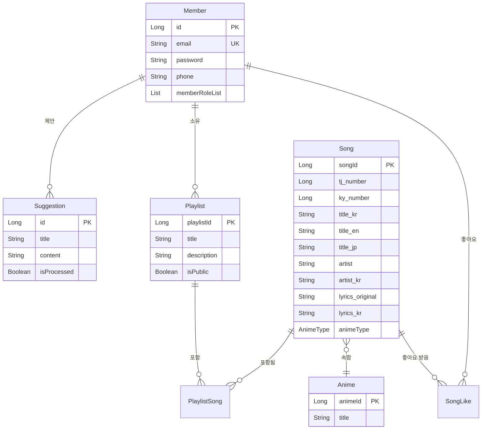
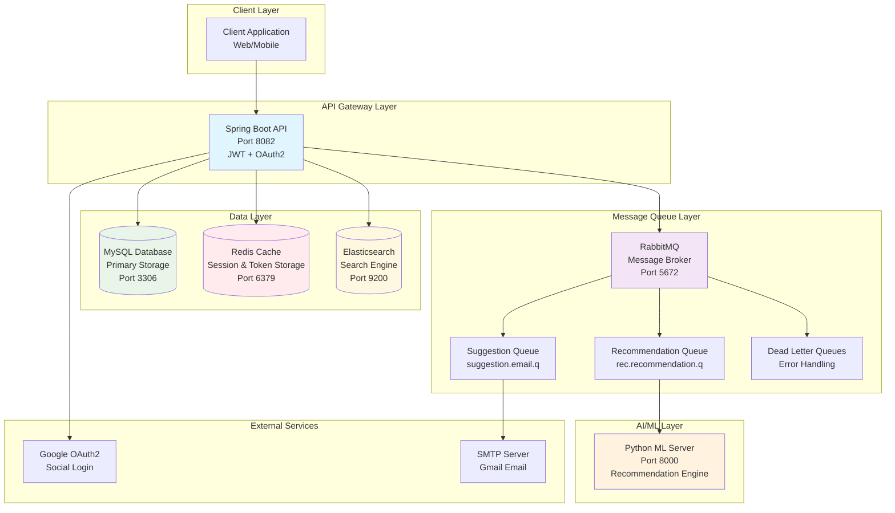
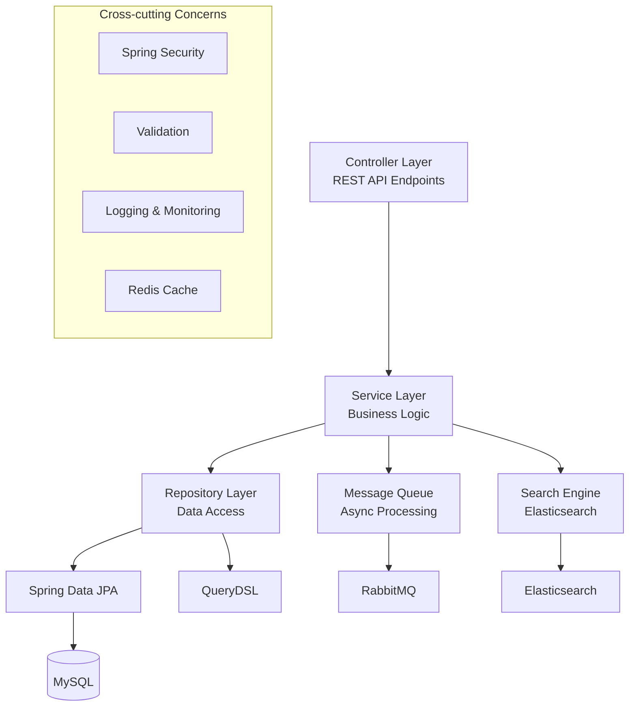
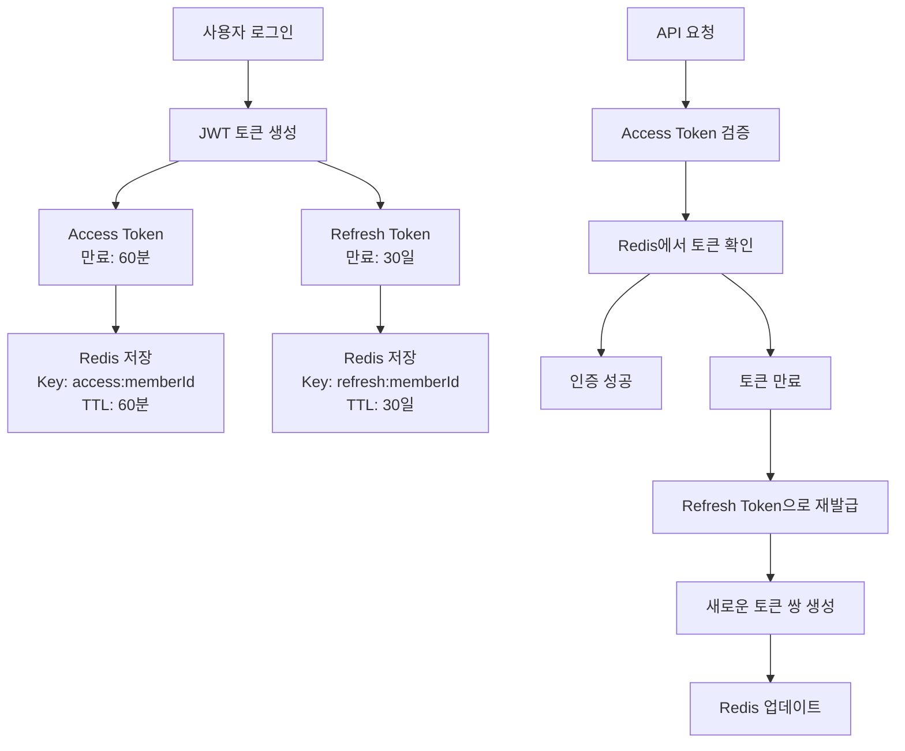

# 🎵 Song Backend API

> **애니메이션 음악 전문 스트리밍 서비스**  
> Spring Boot 3.3.0 기반의 고성능 RESTful API

[](https://openjdk.org/projects/jdk/17/)
[](https://spring.io/projects/spring-boot)
[](https://www.mysql.com/)
[](https://redis.io/)
[](https://www.elastic.co/)
[](https://www.rabbitmq.com/)

---

## 📋 목차

### 🏗️ **아키텍처 & 설계**

- [📖 프로젝트 개요](#-프로젝트-개요)
- [🛠 기술 스택](#-기술-스택)
- [🏛 도메인 모델](#-도메인-모델)
- [🏗 시스템 아키텍처](#-시스템-아키텍처)

### ⚙️ **핵심 시스템**

- [🔄 비동기 처리](#-비동기-처리)
- [🔍 검색 시스템](#-검색-시스템)

### 🚀 **시작하기**

- [⚡ 빠른 시작](#-빠른-시작)
- [📚 API 문서](#-api-문서)
- [🐳 Docker 실행](#-docker-실행)
- [💻 개발 환경 설정](#-개발-환경-설정)

### 🔧 **운영 & 관리**

- [📊 모니터링](#-모니터링)
- [🔧 트러블슈팅](#-트러블슈팅)

---

## 📖 프로젝트 개요

**Song Backend**는 **애니메이션 음악에 특화된** 스트리밍 서비스를 위한 고성능 RESTful API입니다.  
마이크로서비스 아키텍처 패턴을 적용하여 확장성과 유지보수성을 고려한 설계로 구현되었습니다.

### 🎨 핵심 특징

| 특징                        | 설명                                           |
| --------------------------- | ---------------------------------------------- |
| 🎌 **애니메이션 음악 전문** | 일본 애니메이션 OST, OP/ED 곡 전문 관리        |
| 🔍 **다국어 검색**          | 한국어/일본어/영어 통합 검색 및 초성 검색 지원 |
| ⚡ **고성능 검색**          | Elasticsearch 기반 실시간 검색 엔진            |
| 🔄 **비동기 처리**          | RabbitMQ를 통한 안정적인 메시지 큐 시스템      |
| 🛡️ **보안**                 | JWT + OAuth2 기반 인증/인가 시스템             |
| 📊 **모니터링**             | 구조화된 JSON 로깅 및 Health Check             |

### 🚀 주요 기능

<details>
<summary><strong>🔐 사용자 인증 및 권한 관리</strong></summary>

- **JWT 토큰 기반 인증** (Access/Refresh Token)
- **OAuth2 Google 소셜 로그인**
- **역할 기반 접근 제어** (RBAC)
- **AES 암호화**를 통한 민감 정보 보호

</details>

<details>
<summary><strong>🎵 음악 관리 시스템</strong></summary>

- **다국어 메타데이터** 지원 (한/일/영)
- **TJ/KY 노래방 번호** 연동
- **가사 다국어 버전** 관리
- **애니메이션 카테고리별** 분류

</details>

<details>
<summary><strong>📝 플레이리스트 관리</strong></summary>

- **개인/공개 플레이리스트** 생성
- **플레이리스트 공유** 및 협업
- **곡 순서 관리** 및 편집

</details>

<details>
<summary><strong>❤️ 좋아요 및 추천 시스템</strong></summary>

- **사용자별 좋아요** 관리
- **머신러닝 기반 음악 추천** (Python 서버 연동)
- **비동기 추천 생성** 및 캐싱

</details>

<details>
<summary><strong>🔍 고급 검색 기능</strong></summary>

- **Elasticsearch 기반** 전문 검색
- **다국어 필드 통합** 검색
- **한국어 초성 검색** 지원
- **가중치 기반** 관련도 정렬

</details>

<details>
<summary><strong>📊 실시간 비동기 처리</strong></summary>

- **RabbitMQ 메시지 큐**를 통한 백그라운드 작업
- **추천 시스템** 비동기 처리
- **이메일 알림 시스템**
- **재시도 메커니즘** 및 DLQ 처리

</details>

<details>
<summary><strong>💌 건의사항 시스템</strong></summary>

- **사용자 피드백** 수집
- **이메일 자동 알림**
- **관리자 대시보드** 연동

</details>

## 🛠 기술 스택

<table>
<tr>
<td width="50%">

### 🏗️ **Backend Framework**

- **Spring Boot** `3.3.0`
- **Java** `17 LTS`
- **Spring Security**
- **Spring Data JPA**
- **QueryDSL** `5.0.0`
- **Hibernate** `6.4.4`

### 🗄️ **Database & Storage**

- **MySQL** `8.0+`
- **Redis** `6.0+`
- **Elasticsearch** `8.13.4`

### 🔄 **Message Queue**

- **RabbitMQ** `3.13`
- **Spring AMQP**

</td>
<td width="50%">

### 🔐 **Security**

- **JWT** `0.11.5`
- **OAuth2** (Google)
- **AES Encryption**
- **Spring Security**

### 📊 **Monitoring**

- **Spring Boot Actuator**
- **Logback + Logstash**
- **Health Check**

### 🚀 **DevOps**

- **Docker & Docker Compose**
- **Gradle**
- **Flyway**

### 📚 **Additional**

- **Jackson**, **Lombok**
- **SpringDoc OpenAPI**
- **Spring Mail**, **Validation**

</td>
</tr>
</table>

## 🏛 도메인 모델

### 핵심 엔티티



### 주요 도메인 특징

- **Member**: 사용자 관리 및 역할 기반 권한
- **Song**: 다국어 메타데이터를 가진 음악 정보
- **Anime**: 애니메이션 정보 및 음악 카테고리
- **Playlist**: 사용자 커스텀 플레이리스트
- **SongLike**: 사용자-음악 좋아요 관계
- **Suggestion**: 사용자 건의사항 및 피드백

## 🏗 시스템 아키텍처

### 전체 시스템 구조



### 레이어 아키텍처



## 🔄 비동기 처리

### RabbitMQ 백엔드 설정

본 프로젝트는 RabbitMQ를 사용하여 안정적인 비동기 메시지 처리를 구현합니다.

#### 1. RabbitMQ 설정 구성

**Exchange 및 Queue 구조**:

```java
@Configuration
@EnableRabbit
public class RabbitMQConfig {

    // 추천 시스템용 Exchange
    public static final String REC_EXCHANGE = "rec.exchange";
    public static final String DLX_EXCHANGE = "rec.dlx";

    // 건의사항 시스템용 Exchange
    public static final String SUGGESTION_EXCHANGE = "suggestion.exchange";
    public static final String SUGGESTION_DLX = "suggestion.dlx";

    // Queue 설정
    public static final String QUEUE_MAIN = "rec.recommendation.q";
    public static final String QUEUE_RETRY_5S = "rec.recommendation.retry.5s.q";
    public static final String QUEUE_RETRY_30S = "rec.recommendation.retry.30s.q";
    public static final String QUEUE_RETRY_120S = "rec.recommendation.retry.120s.q";
    public static final String QUEUE_DLQ = "rec.recommendation.dlq";
}
```

**Container Factory 설정**:

```java
@Bean
public SimpleRabbitListenerContainerFactory manualAckContainerFactory(ConnectionFactory connectionFactory) {
    SimpleRabbitListenerContainerFactory factory = new SimpleRabbitListenerContainerFactory();
    factory.setConnectionFactory(connectionFactory);
    factory.setAcknowledgeMode(AcknowledgeMode.MANUAL);  // 수동 ACK
    factory.setPrefetchCount(16);  // 동시 처리 메시지 수
    factory.setDefaultRequeueRejected(false);  // 실패 시 재큐잉 방지
    factory.setMessageConverter(jackson2Converter());  // JSON 변환
    return factory;
}
```

#### 2. AI 서버 연결 설정

**RestTemplate 설정**:

```java
@Configuration
public class RestTemplateConfig {

    @Bean
    public RestTemplate restTemplate() {
        return new RestTemplateBuilder()
            .setConnectTimeout(Duration.ofSeconds(10))
            .setReadTimeout(Duration.ofSeconds(60))
            .build();
    }
}
```

**Python AI 서버 통신**:

```java
@Component
public class RestRecommendationCaller {

    @Value("${app.props.python-server-url}")
    private String pythonServerUrl;  // http://python-ml-server:8000

    public RecommendationResponseFromPythonDTO callWithTimeout(
            RecommendationRequestDTO req, Duration timeout) {

        // Python 서버로 POST 요청
        var response = restTemplate.postForEntity(
            pythonServerUrl + "/recommend",
            req,
            String.class
        );

        // JSON 응답 파싱
        return objectMapper.readValue(response.getBody(),
            RecommendationResponseFromPythonDTO.class);
    }
}
```

#### 3. 메시지 처리 플로우

**추천 요청 Publisher**:

```java
@Service
public class RecommendationPublisher {

    public void publish(RecommendationJobMessage message) {
        // RabbitMQ로 메시지 발송
        rabbitTemplate.convertAndSend(
            RabbitMQConfig.REC_EXCHANGE,
            RabbitMQConfig.ROUTING_RECOMMENDATION,
            message
        );
        log.info("추천 작업 메시지 발송: jobId={}", message.getJobId());
    }
}
```

**추천 처리 Consumer**:

```java
@Component
public class RecommendationConsumer {

    @RabbitListener(queues = RabbitMQConfig.QUEUE_MAIN,
                   containerFactory = "manualAckContainerFactory")
    public void handle(RecommendationJobMessage message, Channel channel, Message amqpMessage) {

        try {
            // 1. 사용자 선호 곡 조회
            List<Long> preferred = resolvePreferredSongs(message);

            // 2. AI 서버 요청 DTO 생성
            RecommendationRequestDTO req = RecommendationRequestDTO.builder()
                .memberId(String.valueOf(message.getMemberId()))
                .favoriteSongIds(preferred)
                .build();

            // 3. Python AI 서버 호출 (60초 타임아웃)
            RecommendationResponseFromPythonDTO result =
                restCaller.callWithTimeout(req, Duration.ofSeconds(60));

            // 4. 결과 저장 및 ACK
            jobStore.setSucceeded(jobId, result);
            channel.basicAck(deliveryTag, false);

        } catch (TransientException e) {
            // 일시적 오류 - 재시도 큐로 이동
            requeueWithBackoff(message, attempt);
            channel.basicAck(deliveryTag, false);

        } catch (Exception e) {
            // 영구적 오류 - DLQ로 이동
            channel.basicNack(deliveryTag, false, false);
        }
    }
}
```

#### 4. AI 서버 API 스펙

**요청 형식**:

```json
POST /recommend
{
  "memberId": "123",
  "favoriteSongIds": [1, 5, 10, 23, 45]
}
```

**응답 형식**:

```json
{
  "memberId": "123",
  "recommendedSongIds": [67, 89, 12, 34, 56],
  "confidence": 0.85,
  "modelVersion": "v1.2.3",
  "generatedAt": "2024-01-01T12:00:00Z"
}
```

#### 5. 환경 설정

```yaml
# application.yml
spring:
  rabbitmq:
    host: ${RABBITMQ_HOST:localhost}
    port: ${RABBITMQ_PORT:5672}
    username: ${RABBITMQ_USERNAME:guest}
    password: ${RABBITMQ_PASSWORD:guest}

app:
  props:
    python-server-url: ${PYTHON_SERVER_URL} # AI 서버 URL
  rabbitmq:
    prefetch: ${RABBITMQ_PREFETCH:16} # 동시 처리 메시지 수
```

#### 6. 추천 시스템 메시지 플로우

```mermaid
graph TB
    User[사용자 추천 요청] --> Controller[RecommendationController<br/>POST /api/recommendation/request]
    Controller --> Publisher[RecommendationPublisher<br/>메시지 발송]

    Publisher --> MainQ[rec.recommendation.q<br/>메인 큐]
    MainQ --> Consumer[RecommendationConsumer<br/>@RabbitListener]

    Consumer --> PreferredSongs[사용자 선호 곡 조회<br/>MySQL/JPA]
    PreferredSongs --> AIRequest[AI 서버 요청 생성<br/>RecommendationRequestDTO]

    AIRequest --> PythonCall[Python AI 서버 호출<br/>POST /recommend<br/>60초 타임아웃]

    PythonCall --> AISuccess[AI 응답 성공<br/>추천 곡 목록 반환]
    PythonCall --> AIFail[AI 응답 실패<br/>타임아웃 또는 오류]

    AISuccess --> StoreResult[결과 저장<br/>JobStore + Cache]
    StoreResult --> ACK[메시지 ACK<br/>처리 완료]

    AIFail --> TransientCheck{일시적 오류?}
    TransientCheck -->|Yes| Retry[재시도 큐 이동<br/>5s → 30s → 120s]
    TransientCheck -->|No| NACK[메시지 NACK<br/>DLQ 이동]

    Retry --> Retry5s[5초 재시도 큐<br/>x-message-ttl: 5000]
    Retry --> Retry30s[30초 재시도 큐<br/>x-message-ttl: 30000]
    Retry --> Retry120s[120초 재시도 큐<br/>x-message-ttl: 120000]

    Retry5s --> MainQ
    Retry30s --> MainQ
    Retry120s --> MainQ

    NACK --> RecommendationDLQ[rec.recommendation.dlq<br/>최종 실패 메시지]
```

#### 7. 건의사항 시스템 메시지 플로우

```mermaid
graph TB
    User[사용자 건의사항 제출] --> SuggestAPI[SuggestionController<br/>POST /api/suggestions]
    SuggestAPI --> SaveDB[건의사항 저장<br/>MySQL Database]
    SaveDB --> SuggestPublisher[SuggestionPublisher<br/>이메일 알림 메시지 발송]

    SuggestPublisher --> SuggestQ[suggestion.email.q<br/>이메일 큐]
    SuggestQ --> EmailConsumer[SuggestionEmailConsumer<br/>@RabbitListener]

    EmailConsumer --> EmailTemplate[이메일 템플릿 생성<br/>제목 + 내용 + 사용자 정보]
    EmailTemplate --> SMTPCall[SMTP 서버 호출<br/>Gmail API]

    SMTPCall --> EmailSuccess[이메일 발송 성공<br/>관리자 알림 완료]
    SMTPCall --> EmailFail[이메일 발송 실패<br/>SMTP 오류]

    EmailSuccess --> EmailACK[메시지 ACK<br/>처리 완료]

    EmailFail --> RetryCheck{재시도 가능?}
    RetryCheck -->|Yes| RetryQ[30초 재시도 큐<br/>x-message-ttl: 30000]
    RetryCheck -->|No| EmailNACK[메시지 NACK<br/>DLQ 이동]

    RetryQ --> SuggestQ
    EmailNACK --> SuggestDLQ[suggestion.email.dlq<br/>최종 실패 메시지]
```

#### 8. RabbitMQ 백엔드 설정 가이드

**Step 1: Docker Compose 설정**

```yaml
# docker-compose.yml
services:
  rabbitmq:
    image: rabbitmq:3.13-management
    container_name: rabbitmq
    ports:
      - "5672:5672" # AMQP 포트
      - "15672:15672" # Management UI 포트
    environment:
      RABBITMQ_DEFAULT_USER: ${RABBITMQ_USERNAME:-guest}
      RABBITMQ_DEFAULT_PASS: ${RABBITMQ_PASSWORD:-guest}
    volumes:
      - rabbitmq_data:/var/lib/rabbitmq
    healthcheck:
      test: ["CMD", "rabbitmq-diagnostics", "check_running", "-q"]
      interval: 10s
      timeout: 5s
      retries: 5
      start_period: 20s
```

**Step 2: Spring Boot 의존성 추가**

```gradle
// build.gradle
dependencies {
    implementation 'org.springframework.boot:spring-boot-starter-amqp'
}
```

**Step 3: RabbitMQ 설정 클래스 작성**

```java
@Configuration
@EnableRabbit
public class RabbitMQConfig {

    // Exchange 생성
    @Bean
    public DirectExchange recExchange() {
        return new DirectExchange("rec.exchange", true, false);
    }

    // Queue 생성 (Durable)
    @Bean
    public Queue recommendationQueue() {
        return QueueBuilder.durable("rec.recommendation.q").build();
    }

    // Binding 설정
    @Bean
    public Binding bindRecommendationQueue() {
        return BindingBuilder.bind(recommendationQueue())
                .to(recExchange())
                .with("recommendation.generate");
    }

    // Manual ACK Container Factory
    @Bean
    public SimpleRabbitListenerContainerFactory manualAckContainerFactory(
            ConnectionFactory connectionFactory) {
        SimpleRabbitListenerContainerFactory factory = new SimpleRabbitListenerContainerFactory();
        factory.setConnectionFactory(connectionFactory);
        factory.setAcknowledgeMode(AcknowledgeMode.MANUAL);
        factory.setPrefetchCount(16);
        factory.setDefaultRequeueRejected(false);
        return factory;
    }
}
```

**Step 4: AI 서버 연결 설정**

```java
@Configuration
public class RestTemplateConfig {

    @Bean
    public RestTemplate restTemplate() {
        return new RestTemplateBuilder()
            .setConnectTimeout(Duration.ofSeconds(10))
            .setReadTimeout(Duration.ofSeconds(60))
            .additionalMessageConverters(new MappingJackson2HttpMessageConverter())
            .build();
    }
}
```

**Step 5: 환경 변수 설정**

```bash
# .env 파일
RABBITMQ_HOST=localhost
RABBITMQ_PORT=5672
RABBITMQ_USERNAME=guest
RABBITMQ_PASSWORD=guest
RABBITMQ_PREFETCH=16

# Python AI 서버 설정
PYTHON_SERVER_URL=http://localhost:8000
```

**Step 6: 서비스 시작 순서**

```bash
# 1. RabbitMQ 서비스 시작
docker-compose up -d rabbitmq

# 2. RabbitMQ 헬스체크 대기
docker-compose logs -f rabbitmq

# 3. Python AI 서버 시작 (별도)
# python -m uvicorn main:app --host 0.0.0.0 --port 8000

# 4. Spring Boot 애플리케이션 시작
docker-compose up -d app
```

#### 3. 메시지 큐 설정

- **Prefetch Count**: 16 (동시 처리 메시지 수)
- **Manual ACK**: 수동 확인 모드로 안정성 보장
- **Retry Strategy**: 지수 백오프 (5s → 30s → 120s)
- **Dead Letter Queue**: 최종 실패 메시지 보관
- **Durable Queues**: 서버 재시작 시에도 메시지 보존

#### 4. AI 서버 연동 설정

```yaml
# application.yml - AI 서버 연결 설정
app:
  props:
    python-server-url: ${PYTHON_SERVER_URL} # http://python-ml-server:8000
  rabbitmq:
    prefetch: ${RABBITMQ_PREFETCH:16}
  suggestion:
    max-retry: ${SUGGESTION_MAX_RETRY:3}

spring:
  rabbitmq:
    host: ${RABBITMQ_HOST:localhost}
    port: ${RABBITMQ_PORT:5672}
    username: ${RABBITMQ_USERNAME:guest}
    password: ${RABBITMQ_PASSWORD:guest}
```

**AI 서버 상태 확인**:

```bash
# Python AI 서버 헬스체크
curl http://localhost:8000/health

# 추천 API 테스트
curl -X POST http://localhost:8000/recommend \
  -H "Content-Type: application/json" \
  -d '{"memberId":"123","favoriteSongIds":[1,2,3]}'
```

## 🔍 검색 시스템

### Elasticsearch 백엔드 설정

#### 1. 인덱스 구조

**songs** 인덱스는 다음과 같은 다국어 필드를 포함합니다:

```json
{
  "songId": "고유 식별자",
  "title_kr": "한국어 제목",
  "title_en": "영어 제목",
  "title_jp": "일본어 제목",
  "title_yomi": "일본어 요미가나",
  "title_yomi_kr": "요미가나 한글 표기",
  "artist": "아티스트명",
  "artist_kr": "아티스트 한글명",
  "anime_name": "애니메이션 제목",
  "lyrics_original": "원본 가사",
  "lyrics_kr": "한국어 가사",
  "tj_number": "TJ 노래방 번호",
  "ky_number": "KY 노래방 번호"
}
```

#### 2. 검색 필드 가중치

- **제목 검색**: `title_kr^6`, `title_en_kr^4`, `anime_name^5`
- **아티스트 검색**: `artist_kr^5`, `artist^3`
- **초성 검색**: `title_kr.initial^6`, `artist_kr.initial^6`
- **가사 검색**: `lyrics_kr`, `lyrics_original`

#### 3. 검색 타입별 전략

```java
// 제목 중심 검색
SearchTarget.TITLE → title_kr, title_en_kr, anime_name 필드 우선

// 아티스트 중심 검색
SearchTarget.ARTIST → artist_kr, artist 필드 우선

// 가사 검색
SearchTarget.LYRICS → lyrics_kr, lyrics_original 필드 검색

// 통합 검색
SearchTarget.ALL → 모든 필드 가중치 적용 검색
```

#### 4. 환경별 설정

**로컬 환경**:

```yaml
spring:
  elasticsearch:
    uris: ${LOCAL_ELASTICSEARCH_URIS}
    username: elastic
    password: ${ELASTIC_PASSWORD}
    restclient:
      ssl:
        bundle: es
```

**운영 환경**:

```yaml
spring:
  elasticsearch:
    uris: ${PROD_ELASTICSEARCH_URIS}
    username: elastic
    password: ${ELASTIC_PASSWORD}
```

#### 5. 데이터 마이그레이션

MySQL에서 Elasticsearch로 데이터 동기화:

```java
@Service
public class SongMigrationService {
    // 전체 곡 데이터를 Elasticsearch로 마이그레이션
    public int migrateAllSongsToElasticsearch()
}
```

---

## ⚡ 빠른 시작

### 📋 필수 요구사항

| 구성 요소            | 버전        | 용도              |
| -------------------- | ----------- | ----------------- |
| ☕ **Java**          | `17+` (LTS) | 런타임 환경       |
| 🐳 **Docker**        | `최신`      | 컨테이너 실행     |
| 🗄️ **MySQL**         | `8.0+`      | 메인 데이터베이스 |
| 🔴 **Redis**         | `6.0+`      | 캐시 & 세션       |
| 🔍 **Elasticsearch** | `8.x`       | 검색 엔진         |
| 🐰 **RabbitMQ**      | `3.13+`     | 메시지 큐         |

### 🚀 빠른 실행 (Docker Compose)

<details>
<summary><strong>1️⃣ 저장소 클론</strong></summary>

```bash
git clone <repository-url>
cd song_be
```

</details>

<details>
<summary><strong>2️⃣ 환경 변수 설정</strong></summary>

`.env` 파일을 생성하고 다음 환경 변수들을 설정하세요:

```bash
# 서버 설정
SERVER_ADDRESS=0.0.0.0
SPRING_PROFILES_ACTIVE=prod

# 데이터베이스 설정
PROD_MYSQL_URL=jdbc:mysql://mysql:3306/song_db?useSSL=false&allowPublicKeyRetrieval=true
PROD_MYSQL_USERNAME=root
PROD_MYSQL_PASSWORD=your_password

# Redis 설정
REDIS_HOST=redis
REDIS_PORT=6379
REDIS_PASSWORD=your_redis_password

# Elasticsearch 설정
PROD_ELASTICSEARCH_URIS=https://elasticsearch:9200
ELASTIC_PASSWORD=your_elastic_password

# RabbitMQ 설정
RABBITMQ_HOST=rabbitmq
RABBITMQ_PORT=5672
RABBITMQ_USERNAME=guest
RABBITMQ_PASSWORD=guest
RABBITMQ_PREFETCH=16

# JWT 설정
JWT_SECRET_KEY=your_jwt_secret_key_here_minimum_32_characters
AES_SECRET_KEY=your_aes_secret_key_here_16_characters

# Google OAuth2 설정
GOOGLE_CLIENT_ID=your_google_client_id
GOOGLE_REDIRECT_URI=http://localhost:8082/login/oauth2/code/google

# 메일 설정 (Gmail 예시)
MAIL_HOST=smtp.gmail.com
MAIL_PORT=587
MAIL_USERNAME=your-email@gmail.com
MAIL_PASSWORD=your-app-password

# 건의사항 설정
SUGGESTION_ADMIN_EMAIL=admin@yourcompany.com
SUGGESTION_MAX_RETRY=3

   # Python ML 서버 (추천 시스템)
PYTHON_SERVER_URL=http://python-ml-server:8000
```

</details>

<details>
<summary><strong>3️⃣ Docker Compose 실행</strong></summary>

```bash
# 백그라운드에서 전체 스택 실행
docker-compose up -d

# 로그 확인
docker-compose logs -f
```

</details>

<details>
<summary><strong>4️⃣ 서비스 확인</strong></summary>

| 서비스               | URL                                   | 계정        |
| -------------------- | ------------------------------------- | ----------- |
| 🌐 **API 서버**      | http://localhost:8082                 | -           |
| 📚 **API 문서**      | http://localhost:8082/swagger-ui.html | -           |
| 🐰 **RabbitMQ 관리** | http://localhost:15672                | guest/guest |
| 💚 **Health Check**  | http://localhost:8082/actuator/health | -           |

</details>

### 🔧 Profile별 설정

| Profile      | 용도      | 주요 특징                                                                               |
| ------------ | --------- | --------------------------------------------------------------------------------------- |
| 🏠 **local** | 로컬 개발 | • SQL 로깅 (DEBUG)<br/>• 바인딩 파라미터 추적<br/>• 트랜잭션 로그<br/>• SSL 인증서 번들 |
| 🚀 **prod**  | 운영 환경 | • 최적화된 로깅 (ERROR)<br/>• HikariCP 연결 풀 튜닝<br/>• 보안 강화 설정                |

## 📚 API 문서

### 📖 Swagger UI

| 문서 타입           | URL                                   | 설명            |
| ------------------- | ------------------------------------- | --------------- |
| 🌐 **Swagger UI**   | http://localhost:8082/swagger-ui.html | 대화형 API 문서 |
| 📄 **OpenAPI JSON** | http://localhost:8082/v3/api-docs     | API 스펙 JSON   |

### 🔗 주요 API 엔드포인트

<details>
<summary><strong>🔐 인증 관리</strong></summary>

| Method | Endpoint             | 설명                 |
| ------ | -------------------- | -------------------- |
| `POST` | `/api/auth/login`    | 로그인               |
| `POST` | `/api/auth/register` | 회원가입             |
| `POST` | `/api/auth/refresh`  | 토큰 갱신            |
| `POST` | `/api/auth/google`   | Google OAuth2 로그인 |
| `POST` | `/api/auth/logout`   | 로그아웃             |

</details>

<details>
<summary><strong>🎵 음악 관리</strong></summary>

| Method   | Endpoint            | 설명                      |
| -------- | ------------------- | ------------------------- |
| `GET`    | `/api/songs`        | 음악 목록 조회 (페이징)   |
| `GET`    | `/api/songs/{id}`   | 특정 음악 상세 조회       |
| `POST`   | `/api/songs`        | 음악 업로드/등록          |
| `PUT`    | `/api/songs/{id}`   | 음악 정보 수정            |
| `DELETE` | `/api/songs/{id}`   | 음악 삭제                 |
| `GET`    | `/api/songs/search` | 음악 검색 (Elasticsearch) |

</details>

<details>
<summary><strong>📝 플레이리스트 관리</strong></summary>

| Method   | Endpoint                                     | 설명                   |
| -------- | -------------------------------------------- | ---------------------- |
| `GET`    | `/api/playlists`                             | 플레이리스트 목록 조회 |
| `GET`    | `/api/playlists/{id}`                        | 특정 플레이리스트 조회 |
| `POST`   | `/api/playlists`                             | 플레이리스트 생성      |
| `PUT`    | `/api/playlists/{id}`                        | 플레이리스트 수정      |
| `DELETE` | `/api/playlists/{id}`                        | 플레이리스트 삭제      |
| `POST`   | `/api/playlists/{id}/songs`                  | 플레이리스트에 곡 추가 |
| `DELETE` | `/api/playlists/{playlistId}/songs/{songId}` | 곡 제거                |

</details>

<details>
<summary><strong>❤️ 좋아요 시스템</strong></summary>

| Method   | Endpoint                | 설명                |
| -------- | ----------------------- | ------------------- |
| `GET`    | `/api/likes`            | 내 좋아요 목록      |
| `POST`   | `/api/likes`            | 좋아요 추가         |
| `DELETE` | `/api/likes/{id}`       | 좋아요 취소         |
| `GET`    | `/api/songs/{id}/likes` | 특정 곡의 좋아요 수 |

</details>

<details>
<summary><strong>🎌 애니메이션 관리</strong></summary>

| Method | Endpoint                 | 설명                   |
| ------ | ------------------------ | ---------------------- |
| `GET`  | `/api/animes`            | 애니메이션 목록        |
| `GET`  | `/api/animes/{id}`       | 특정 애니메이션 정보   |
| `GET`  | `/api/animes/{id}/songs` | 애니메이션별 음악 목록 |

</details>

<details>
<summary><strong>💌 건의사항 시스템</strong></summary>

| Method | Endpoint                 | 설명                        |
| ------ | ------------------------ | --------------------------- |
| `POST` | `/api/suggestions`       | 건의사항 제출               |
| `GET`  | `/api/suggestions`       | 내 건의사항 목록 (사용자)   |
| `GET`  | `/api/admin/suggestions` | 전체 건의사항 관리 (관리자) |

</details>

<details>
<summary><strong>📊 모니터링 & 관리</strong></summary>

| Method | Endpoint           | 설명              |
| ------ | ------------------ | ----------------- |
| `GET`  | `/actuator/health` | 서비스 상태 확인  |
| `GET`  | `/actuator/info`   | 애플리케이션 정보 |

</details>

### 📋 API 응답 형식

<details>
<summary><strong>✅ 성공 응답</strong></summary>

```json
{
  "status": "success",
  "data": { ... },
  "message": "작업이 성공적으로 완료되었습니다."
}
```

</details>

<details>
<summary><strong>📄 페이징 응답</strong></summary>

```json
{
  "status": "success",
  "data": {
    "content": [...],
    "totalElements": 100,
    "totalPages": 10,
    "size": 10,
    "number": 0,
    "first": true,
    "last": false
  }
}
```

</details>

<details>
<summary><strong>❌ 오류 응답</strong></summary>

```json
{
  "status": "error",
  "message": "오류 메시지",
  "code": "ERROR_CODE",
  "timestamp": "2024-01-01T00:00:00"
}
```

</details>

## 🐳 Docker 실행

<details>
<summary><strong>🔧 개발 환경</strong></summary>

```bash
# 1. 애플리케이션 빌드
./gradlew bootJar

# 2. Docker 이미지 빌드
docker build -t song-be:latest .

# 3. Docker Compose로 전체 스택 실행
docker-compose up -d
```

</details>

<details>
<summary><strong>🚀 운영 환경</strong></summary>

```bash
# 1. 환경 변수 설정
export DOCKER_IMAGE_NAME=your-registry/song-be
export SPRING_PROFILES_ACTIVE=prod

# 2. Docker Compose 실행
docker-compose -f docker-compose.yml up -d
```

</details>

---

## 💻 개발 환경 설정

### 🏠 로컬 개발 실행

<details>
<summary><strong>1️⃣ 데이터베이스 준비</strong></summary>

로컬에 다음 서비스들이 설치되어 있어야 합니다:

- MySQL 8.0+
- Redis 6.0+
- Elasticsearch 8.x
- RabbitMQ 3.13+

</details>

<details>
<summary><strong>2️⃣ 환경 변수 설정</strong></summary>

```bash
export SPRING_PROFILES_ACTIVE=local
# 기타 필요한 환경 변수들...
```

</details>

<details>
<summary><strong>3️⃣ 애플리케이션 실행</strong></summary>

```bash
./gradlew bootRun
```

</details>

### 🧪 테스트 실행

| 명령어                                                                | 설명             |
| --------------------------------------------------------------------- | ---------------- |
| `./gradlew test`                                                      | 전체 테스트 실행 |
| `./gradlew test --tests "com.example.song_be.SongBeApplicationTests"` | 특정 테스트 실행 |

### ⚙️ QueryDSL Q클래스 생성

```bash
./gradlew compileJava
```

## 📊 모니터링

### 💚 Health Check

| 서비스              | 엔드포인트                    | 설명                   |
| ------------------- | ----------------------------- | ---------------------- |
| 🌐 **애플리케이션** | `GET /actuator/health`        | 전체 서비스 상태       |
| 🗄️ **MySQL**        | `GET /actuator/health/db`     | 데이터베이스 연결 상태 |
| 🔴 **Redis**        | `GET /actuator/health/redis`  | Redis 연결 상태        |
| 🐰 **RabbitMQ**     | `GET /actuator/health/rabbit` | RabbitMQ 연결 상태     |

### 📋 로그 확인

<details>
<summary><strong>Docker 컨테이너 로그</strong></summary>

```bash
# 실시간 로그 확인
docker-compose logs -f app

# 특정 시간대 로그
docker-compose logs --since="1h" app

# 모든 서비스 로그
docker-compose logs -f
```

</details>

### 🐰 RabbitMQ 관리

| 항목               | 정보                               |
| ------------------ | ---------------------------------- |
| 🌐 **관리 UI**     | http://localhost:15672             |
| 👤 **기본 계정**   | guest/guest                        |
| 📊 **큐 모니터링** | Exchange, Queue, Binding 상태 확인 |

## 🔧 트러블슈팅

### 🔐 JWT 토큰 관리 이슈

본 프로젝트에서는 Redis를 활용한 JWT 토큰 관리 시스템을 구현했습니다. Access Token과 Refresh Token 모두 Redis에 저장되어 안전하고 효율적인 토큰 관리가 가능합니다.

#### 1. JWT 토큰 저장 및 관리 구조



#### 2. 토큰 재발급 로직

**Access Token 만료 시 자동 재발급**:

```java
// 1. Access Token 검증 실패 시
if (accessTokenExpired) {
    // 2. Redis에서 Refresh Token 조회
    String refreshToken = redisTemplate.opsForValue()
        .get("refresh:" + memberId);

    // 3. Refresh Token 유효성 검증
    if (refreshToken != null && jwtUtil.validateToken(refreshToken)) {
        // 4. 새로운 Access Token 생성
        String newAccessToken = jwtUtil.generateAccessToken(memberInfo);

        // 5. Redis에 새 Access Token 저장 (60분 TTL)
        redisTemplate.opsForValue().set(
            "access:" + memberId,
            newAccessToken,
            Duration.ofMinutes(60)
        );

        // 6. 클라이언트에 새 토큰 반환
        return ResponseEntity.ok()
            .header("New-Access-Token", newAccessToken)
            .body(response);
    }
}
```

**Refresh Token 만료 시 재로그인 필요**:

```java
// Refresh Token도 만료된 경우
if (refreshTokenExpired) {
    // Redis에서 모든 토큰 삭제
    redisTemplate.delete("access:" + memberId);
    redisTemplate.delete("refresh:" + memberId);

    // 401 Unauthorized 반환 (재로그인 필요)
    return ResponseEntity.status(HttpStatus.UNAUTHORIZED)
        .body("토큰이 만료되었습니다. 다시 로그인해주세요.");
}
```

#### 3. 주요 토큰 이슈 및 해결 방법

**이슈 1: Access Token 검증 실패**

```bash
# Redis에서 토큰 상태 확인
redis-cli -h localhost -p 6379
> GET access:123  # memberId가 123인 경우
> TTL access:123  # 남은 만료 시간 확인
```

**해결 방법**:

- Redis 연결 상태 확인
- 토큰 만료 시간 확인
- JWT Secret Key 일치 여부 확인

**이슈 2: Refresh Token으로 재발급 실패**

```bash
# Refresh Token 상태 확인
redis-cli
> GET refresh:123
> TTL refresh:123
```

**해결 방법**:

- Refresh Token 유효성 검증
- Redis TTL 설정 확인
- JWT Secret Key 일치 여부 확인

**이슈 3: 동시 로그인 시 토큰 충돌**

```java
// 해결: 로그인 시 기존 토큰 삭제 후 새 토큰 생성
public void login(String email, String password) {
    // 기존 토큰 삭제
    redisTemplate.delete("access:" + memberId);
    redisTemplate.delete("refresh:" + memberId);

    // 새 토큰 생성 및 저장
    generateAndStoreTokens(memberId);
}
```

**이슈 4: AES 암호화/복호화 실패**

```bash
# AES Secret Key 길이 확인 (정확히 16자여야 함)
echo $AES_SECRET_KEY | wc -c
```

**해결 방법**:

- `AES_SECRET_KEY` 길이 확인 (정확히 16바이트/16자)
  - 환경 변수 설정 확인
- 암호화된 데이터 형식 검증

**AES 암호화 테스트**:

```java
// AES 암호화/복호화 테스트
@Autowired
private AesUtil aesUtil;

public void testAesEncryption() {
    String plainText = "test-refresh-token";

    // 암호화
    String encrypted = aesUtil.encrypt(plainText);
    System.out.println("Encrypted: " + encrypted);

    // 복호화
    String decrypted = aesUtil.decrypt(encrypted);
    System.out.println("Decrypted: " + decrypted);

    // 검증
    assert plainText.equals(decrypted);
}
```

**이슈 5: Redis에 저장된 암호화 토큰 검증 실패**

```bash
# Redis에서 암호화된 토큰 확인
redis-cli
> GET refresh:123
# 출력 예시: "YWJjZGVmZ2hpams..." (Base64 인코딩된 암호화 데이터)
```

**해결 방법**:

- 저장된 데이터가 Base64 형식인지 확인
- AES Secret Key 일치 여부 확인
- 암호화/복호화 과정에서 문자 인코딩 확인

#### 4. 토큰 관리 모니터링

**Redis 토큰 현황 확인**:

```bash
# 현재 저장된 Access Token 수 확인
redis-cli --scan --pattern "access:*" | wc -l

# 현재 저장된 Refresh Token 수 확인
redis-cli --scan --pattern "refresh:*" | wc -l

# 특정 사용자의 토큰 정보 확인
redis-cli
> GET access:123
> GET refresh:123
> TTL access:123
> TTL refresh:123
```

**로그아웃 시 토큰 정리**:

```java
public void logout(Long memberId) {
    // Redis에서 모든 토큰 삭제
    redisTemplate.delete("access:" + memberId);
    redisTemplate.delete("refresh:" + memberId);
}
```

#### 5. 환경 설정 확인

**JWT 관련 환경 변수**:

```bash
# JWT Secret Key (최소 32자 이상)
JWT_SECRET_KEY=your_jwt_secret_key_here_minimum_32_characters

# 토큰 만료 시간 설정 (분 단위)
JWT_ACCESS_TOKEN_EXPIRATION=60      # 60분
JWT_REFRESH_TOKEN_EXPIRATION=43200  # 30일 (60*24*30)
```

**AES 암호화 설정**:

```bash
# AES Secret Key (정확히 16자여야 함)
AES_SECRET_KEY=your_aes_key_16ch

# 잘못된 예시 (길이가 맞지 않음)
❌ AES_SECRET_KEY=short          # 5자 (너무 짧음)
❌ AES_SECRET_KEY=too_long_key   # 14자 (너무 짧음)
❌ AES_SECRET_KEY=this_is_too_long_for_aes_key # 너무 긺

# 올바른 예시
✅ AES_SECRET_KEY=my_secret_key16  # 정확히 16자
✅ AES_SECRET_KEY=abcdefghijklmnop  # 정확히 16자
```

**Redis 연결 설정**:

```bash
# Redis 연결 정보
REDIS_HOST=localhost
REDIS_PORT=6379
REDIS_PASSWORD=your_redis_password
```

#### 6. 일반적인 해결 방법

**AES 암호화 키 문제 해결**:

```bash
# AES Secret Key 길이 검증
echo -n $AES_SECRET_KEY | wc -c  # 정확히 16이어야 함

# 새로운 16자 키 생성 (개발용)
openssl rand -hex 8  # 16자 헥사 문자열 생성
# 또는
head /dev/urandom | tr -dc A-Za-z0-9 | head -c 16  # 16자 랜덤 문자열
```

**암호화 관련 환경 변수 재설정**:

```bash
# .env 파일에서 AES 키 업데이트
sed -i 's/AES_SECRET_KEY=.*/AES_SECRET_KEY=your_new_16char_key/' .env

# 애플리케이션 재시작 (새 키 적용)
docker-compose restart app
```

**전체 토큰 초기화** (개발 환경):

```bash
# Redis의 모든 토큰 삭제
redis-cli FLUSHDB

# 또는 패턴별 삭제
redis-cli --scan --pattern "access:*" | xargs redis-cli DEL
redis-cli --scan --pattern "refresh:*" | xargs redis-cli DEL
```

**서비스 재시작**:

```bash
# Redis 재시작
docker-compose restart redis

# 애플리케이션 재시작
docker-compose restart app

# 전체 스택 재시작 (환경 변수 변경 시)
docker-compose down
docker-compose up -d
```

**디버깅을 위한 로그 확인**:

```bash
# AES 관련 오류 로그 확인
docker-compose logs app | grep -i "aes\|encrypt\|decrypt"

# Redis 관련 오류 로그 확인
docker-compose logs app | grep -i "redis\|refresh"

# JWT 관련 오류 로그 확인
docker-compose logs app | grep -i "jwt\|token"
```

---

## 📄 부록

### 📝 라이선스

이 프로젝트는 **MIT 라이선스** 하에 배포됩니다.

### 👥 기여하기

1. **Fork** the Project
2. **Create** your Feature Branch (`git checkout -b feature/AmazingFeature`)
3. **Commit** your Changes (`git commit -m 'Add some AmazingFeature'`)
4. **Push** to the Branch (`git push origin feature/AmazingFeature`)
5. **Open** a Pull Request

### 📞 연락처

프로젝트에 대한 질문이나 제안사항이 있으시면 **이슈를 생성**해 주세요.
